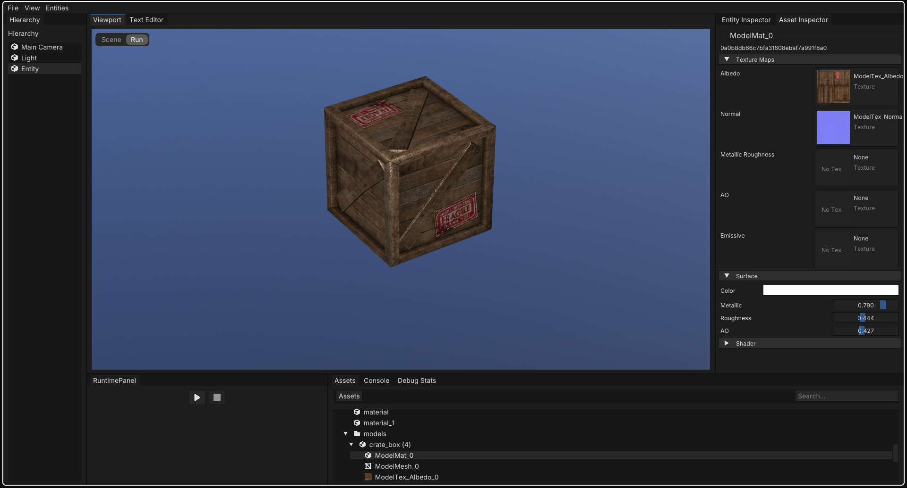
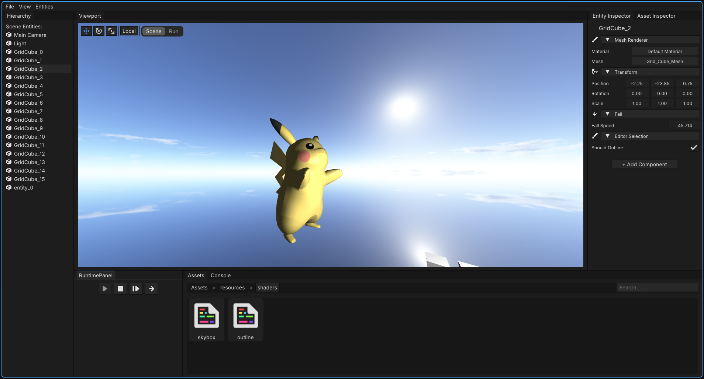

# Origo

Origo is a Linux only 3D game engine written in C++23 and modern OpenGL.

---

## Design Choices and Goals

Origo is not intended to compete with established engines such as Unity or Godot.
It is a learning project developed for submission to the CV-Tag 2026 at the University of Koblenz.

---

## Showcase

---

## Requirements

- **OS:** Linux  
  Developed and tested on Arch Linux

- **Compiler:** GCC with C++23 support

- **Graphics:** OpenGL  
  Proper driver support required (Mesa recommended)

- **Build system:** CMake

---
  
## License

Licensed under the Apache License, Version 2.0.  
See the [LICENSE](LICENSE) and [NOTICE](NOTICE) files for details.
e the [LICENSE](LICENSE) and [NOTICE](NOTICE) files for details.
