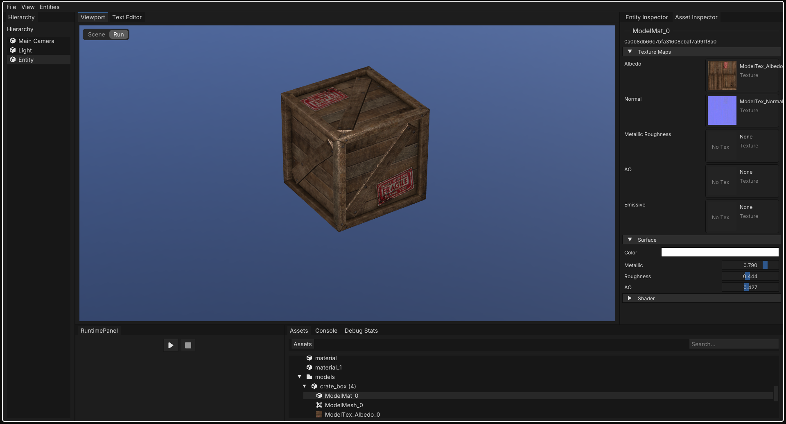
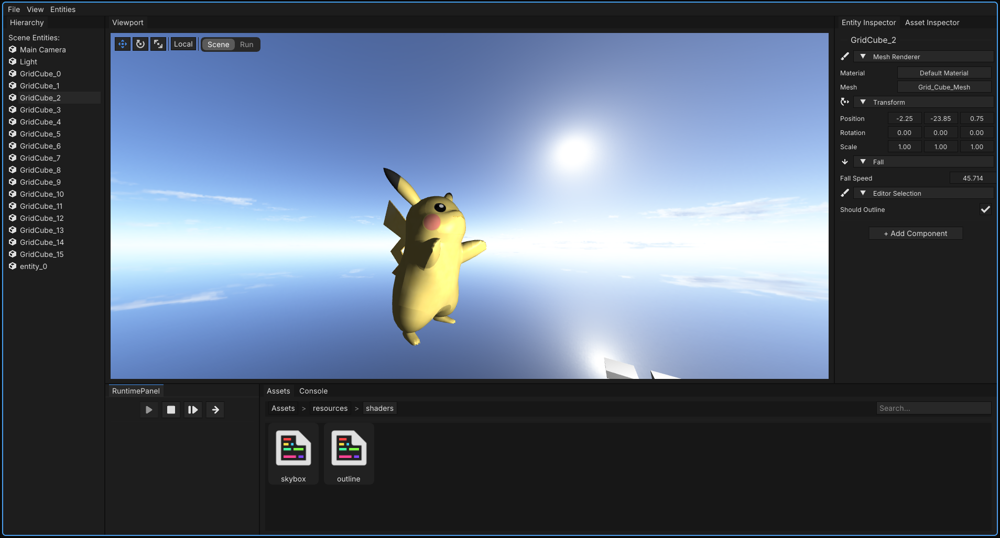

<p align="center">
  
</p>

<h1 align="center">Origo</h1>

<p align="center">
  Origo is a Linux only 3D game engine written in C++23 and modern OpenGL.
</p>

---

## Design Choices and Goals

Origo is not intended to compete with established engines such as Unity or Godot.
It is a learning project developed for submission to the CV-Tag 2026 at the University of Koblenz.

---

## Showcase

<p align="center">
  
  
</p>

---

## Requirements

- **OS:** Linux  
  Developed and tested on Arch Linux

- **Compiler:** GCC with C++23 support

- **Graphics:** OpenGL  
  Proper driver support required (Mesa recommended)

- **Build system:** CMake + Ninja

---

## Clone and Build

The repository vendors its third-party dependencies directly, so a normal clone is enough:

```bash
git clone https://github.com/SalarAlo/origo.git
```

Then configure and build the project:

```bash
cmake -S . -B build -G Ninja
cmake --build build
```

---
  
## License

Licensed under the Apache License, Version 2.0.  
See the [LICENSE](LICENSE) and [NOTICE](NOTICE) files for details.
